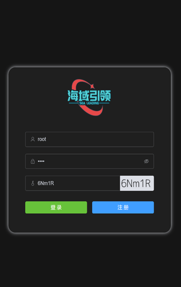
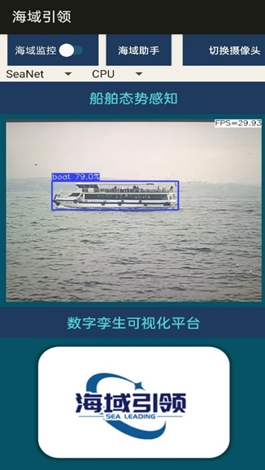
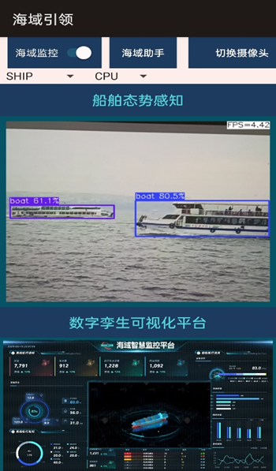
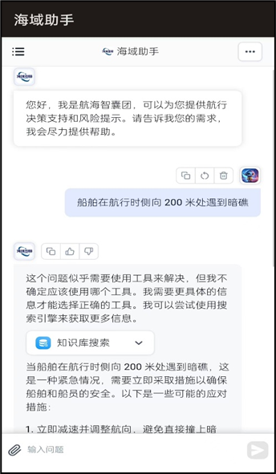
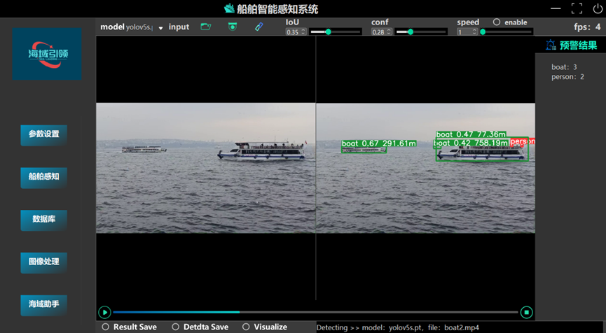
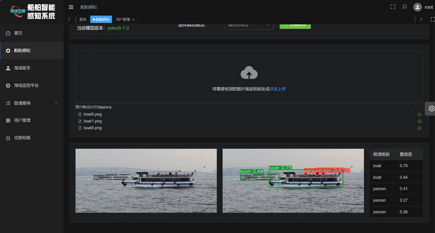
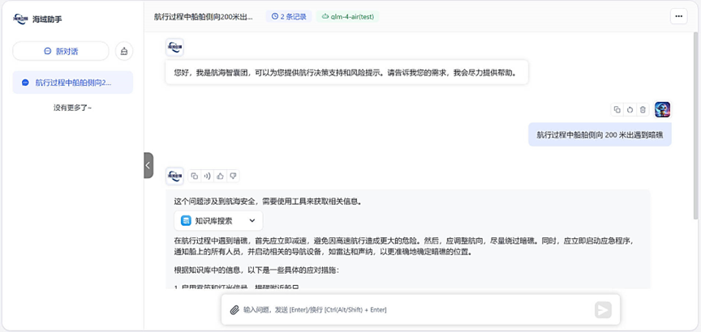

# 🌊 海域引领 — 船舶智能态势感知 Android App

> **简介**：移动端为“海域引领”多端系统在边缘侧的实现，基于 NCNN 优化的 YOLO 模型实现海上目标识别与风险预警，集成 Dify/RAG 增强的大模型海域助手，提供在线航行问题响应与数字孪生可视化。
>
> 本仓库仅包含 Android 移动端源码（基于 Android Studio）用于功能演示，对于项目的完整桌面端网页端系统后续脱敏后开源。

---

## ✨ 仓库亮点（Quick Highlights）

- 🧠 **边缘检测**：NCNN + HMPNet（轻量化）实现离线/实时目标检测
- 🤖 **智能助手**：RAG + 微调大模型（Dify/后端）提供应急决策建议
- 📱 **多端协同**：移动端支持船载端 / Web 服务端协作与数字孪生展示

---

## 📁 目录结构

```

repo-root/
├─ app/                            # Android Studio 工程
│  ├─ src/main/assets/models/      # NCNN 模型 (.param/.bin)
│  ├─ src/main/assets/screenshots/ # 截图占位
│  └─ ...
├─ build
├─ gradle
├─ build.gradle
├─ gradlew.bat
└─ README.md

```

---

## 📸 App 界面展示

- `login.png` — 登录 / 启动界面
- `main.png` — 主界面（检测/地图）
- `detection_result.png` — 检测结果示例（目标框 + 距离）
- `assistant.png` — 海域助手问答界面（RAG 返回）
- `digital_twin.png` — 数字孪生/可视化界面
- `settings.png` — 设置 / 模型切换界面

<table>
  <tr>
    <td align="center">
      
      <p><em>图：登录 / 启动界面</em></p>
    </td>
    <td align="center">
      
      <p><em>图：主界面 — 实时检测与海域信息</em></p>
    </td>
  </tr>
  <tr>
    <td align="center">
      
      <p><em>图：检测结果（目标识别、测距）</em></p>
    </td>
    <td align="center">
      
      <p><em>图：海域助手 — RAG 问答与决策建议</em></p>
    </td>
  </tr>
</table>

---

## 🛠 快速开始（本地运行）

1. 克隆仓库：

```bash
git clone https://github.com/xi029/Android-YOLO-Dify.git
cd Android-YOLO-Dify
```

2. 将 NCNN 模型文件放入：

```
app/src/main/assets/models/
# 文件示例：yololn.param, yololn.bin
```

3. 在 Android Studio 中打开项目 -> 同步 Gradle -> 运行到真机（建议开启 USB 调试）。

4. 配置后端（RAG / Dify）地址：在 `app/src/main/res/values/config.xml` 或 `BuildConfig` 中填入 `RAG_API_URL` 与 `API_KEY`。

---

## 🧾 NCNN 模型部署（简要指南）

1. PyTorch -> ONNX 导出（示例）：

```python
torch.onnx.export(model, dummy_input, "model.onnx", opset_version=11)
```

2. ONNX -> NCNN：

```bash
onnx2ncnn model.onnx model.param model.bin
ncnnoptimize model.param model.bin model-opt.param model-opt.bin 0
```

3. 将 `model-opt.param` / `model-opt.bin` 放入 `app/src/main/assets/models/`。

4. Android 端使用 NCNN JNI（或嵌入式 libs）加载模型进行推理。

---

## 🔗 RAG（海域助手）集成说明

- **在线方案（推荐）**：移动端发送上下文（位置信息 + 检测结果）到后端 RAG 服务，后端返回应急建议。
- 简单请求示例（JSON）：

```

{
  "location": {"lat":xx,"lon":yy},
  "detected": [{"type":"boat","distance":120}],
  "query": "前方遇到未知漂浮物，如何处理？"
}
```

- 后端（Dify / 自建）负责检索海域知识库并调用微调大模型生成候选方案。

---

#### 🌊 桌面端和网页端系统展示

代码脱敏后开源

###### 桌面端界面展示（PyQt+MySQL+OpenCV+Dify）



###### Web 端界面展示（Vue3+flask+YOLO）



###### RAG 问答与决策建议(Dify+知识库+大模型)



---

## ✅ 常见问题（FAQ）

- **如何替换模型？**
  将新生成的 `.param/.bin` 覆盖 `assets/models/` 下同名文件，并重启 App。

- **如何在无网络下使用海域助手？**
  目前推荐在线服务；可实现本地缓存规则/应急片段供离线参考（后续迭代）。

- **如何开启硬件加速？**
  若设备支持 NNAPI 或厂商 NPU，请在编译和 NCNN 配置中开启对应 delegate。

---

## 🙏 致谢 & 合作单位

感谢合作：

- 中国船舶集团天津航海仪器研究所
- 天津海蕴隆石油技术有限公司

---

## ✉ 联系方式

邮箱：[fengyuan711@gmail.com](mailto:your.email@example.com)

---

## 📜 许可证

本项目采用 **Apache License2.0**。

---

## 🚀 **欢迎 Star & Fork 支持本项目！** 🎉

## 🤝 贡献

欢迎提交 Issue 和 Pull Request 来改进项目！如果您有任何建议或发现了问题，都可以随时告诉我们。
